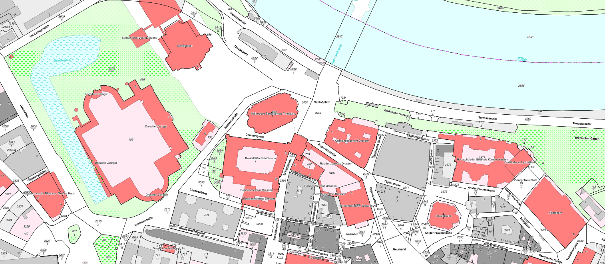

# ALKIS-WMS für den Freistaat Sachsen

Ein teilautomatisierter Workflow zur Bereitstellung eines OGC-konformen **WMS-Dienstes** (Web Map Service) für die **ALKIS-Daten** (Amtliches Liegenschaftskataster-Informationssystem) des Freistaats Sachsen mithilfe von **Bash-Skripten** und **MapServer**.

## 🔍 Projektbeschreibung

Dieses Projekt ermöglicht die einfache Bereitstellung und Visualisierung ausgewählter ALKIS-Daten des Freistaats Sachsen als WMS-Dienst. Die Daten sind über den [Downloadbereich Offene Geodaten](https://www.geodaten.sachsen.de/index.html) im NAS-Format (Normbasierte Austauschschnittstelle) erreichbar.

Ziel ist es, den Import, die Transformation und die Ausspielung dieser Daten in einem WebGIS-Dienst zu automatisieren – mit freier Software und reproduzierbaren Skripten.

---

## 🧰 Verwendete Komponenten

- **Bash** – Automatisierung der Verarbeitungsschritte
- **MapServer** – Bereitstellung der Mapfiles
- **ogr2ogr / GDAL** – Umwandlung der NAS-Daten in das ALKIS-Schemata der Fa. Norbit [alkisimport](https://github.com/norBIT/alkisimport/tree/master)
- **NAS-Daten** – Bereitgestellt von: [Offene Geodaten](https://www.geodaten.sachsen.de/downloadbereich-alkis-4176.html)

---

## 🚀 Funktionsumfang

- Erstellung einer Filelist (***import_All.sh***), nach Download der NAS-Daten (kann ggf. mit geringem Aufwand automatisiert werden)
- Allgemeine Anpassungen wie EPSG, SCHEMA, AVOIDDUPES, HISTORIE oder USECOPY in ***alkis-import.sh***
- Prozessierung via ***create_alkis_sn.sh***
    - Umwandlung der NAS-Daten in ALKIS-Schemata für Postgres-DB
    - weitere Infos: [hier](https://www.norbit.de/74)
- Bereitstellung ALKIS-Mapfiles (`.map`-Datei) in Schwarz-Weiß und in Farbe (**Grundlage**: [GitHub-Projekt](https://github.com/norBIT/alkisplugin))
- Erstellung eines MapServer-Dienstes kann [hier](https://github.com/wm87/wms-opendata/tree/main/mapserver) nachvollzogen werden => **Ziel: Bereitstellung eines OGC WMS-Endpunkts** zur Integration in GIS-Anwendungen wie QGIS

---

## 📁 Verzeichnisstruktur
```text
 .
├──  aaa_template_sn
│   ├──  alkis-schema.gfs
│   ├──  alkis-schema_25833.sql
│   └──  setup_Schema_PostNAS.sh
├──  admin
│   └──  create_alkis_sn.sh
├──  alkisimport_norgis
│   ├──  13068.prj
...
│   ├──  alkis-clean.sql
│   ├──  alkis-compat.sql
│   ├──  alkis-functions.sql
│   ├──  alkis-import.cmd
│   ├──  alkis-import.sh
...
│   ├──  alkis-schema.gfs
│   ├──  alkis-schema.sql
│   ├──  alkis-trigger.sql
│   ├──  alkis-update.sql
│   ├──  alkis-wertearten.sql
│   ├──  alkisImport.py
...
├──  filelists
├──  import
│   └──  import_All.sh
├──  mapserver
│   ├──  fonts
│   ├──  svg
│   ├──  wms_alkis_sn_color.map
│   └──  wms_alkis_sn_sw.map
└──  README.md
```

## 📦 Installation & Nutzung

### 1. Voraussetzungen

Installiere u.a. folgende Abhängigkeiten:

```bash
sudo apt install postgresql-18 postgresql-18-postgis-3 gdal-bin postgis mapserver-bin cgi-mapserver unzip
```

### 2. Anpassung der Skripte

* DB-Template anpassen: ***setup_Schema_PostNAS.sh***
* Pfade anpassen: ***import_All.sh*** (z.B. filelist=$HOME/alkis_sn/filelists/nas_sn.lst)
* Pfade anpassen: ***alkis-import.sh*** (z.B. /opt/gdal/bin/ogr2ogr)
* Pfade anpassen: ***create_alkis_sn.sh*** 

### 3. Mapserver kompilieren bzw. Mapserver-Dienst einrichten

#### 3.1 Mapserver & GDAL kompilieren

siehe hier: https://github.com/wm87/compile_gdal_mapserver

#### 3.2 Mapserver-Dienst einrichten

siehe hier: https://github.com/wm87/wms-opendata/tree/main/mapserver

### 4. Nutzung ALKIS-WMS in GIS-Software

| Aspekt                | Beschreibung                                                  |
|-----------------------|---------------------------------------------------------------|
| **WMS-URL (Color)**   | `http://localhost/wms/sn/alkis_sn_color.fcgi`                 |
| **WMS-URL (SW)**      | `http://localhost/wms/sn/alkis_sn_sw.fcgi`                    |
| **WMS-Version**       | 1.1.1 oder 1.3.0 (je nach unterstützter Version der Software) |
| **Koordinatensysteme**| ETRS89 / UTM32N (EPSG:25833) oder andere unterstützte SRS     |
| **Nutzung in QGIS**   | Menü: "Layer" → "WMS/WMTS-Layer hinzufügen" → URL einfügen    |

## ALKIS-WMS in Farbe



## ALKIS-WMS in SW


## Verwendetes Setup

| Komponente       | Spezifikation                                  |
|------------------|------------------------------------------------|
| CPU              | Intel Core i7-8700K (6 Kerne)                  |
| RAM              | 61 GB DDR4 @ 3000 MHz                          |
| Speicher         | 1 TB SSD                                       |
| Betriebssystem   | Ubuntu 25.10                                   |
| Virtualisierung  | VMware Workstation                             |
| Datenbank        | psql (PostgreSQL) 18.1                         |
| Geodaten-Tool    | GDAL 3.12.0 "Chicoutimi", released 2025/11/08  |


## Laufzeiten des Skripts: create_alkis_sn.sh

Durch starke Optimierung der Basis-Skripte wurden gravierend bessere Laufzeiten erreicht. Statt über 20h Laufzeit auf ca: 1h bei entsprechend o.g. Setup. Weitere Optimierungen sind möglich, jedoch sehr zeitaufwendig. Flaschenhälse zu lokalisieren ist ein Aspekt, doch konkrete Optimierungsschritte sind nocheinmal ein ganz anderes Level.

| Messung         | Dauer  |
|-----------------|--------|
| mit Vollimport  | 75 min |
| ohne Vollimport | 60 min |

## 🤝 Mitwirken
Pull Requests, Verbesserungsvorschläge oder Erweiterungen sind willkommen! Bitte stelle sicher, dass du die Datenquellen korrekt zitierst und keine personenbezogenen Daten veröffentlichst.

## 🛡️ Haftungsausschluss
Dieses Projekt ist ein Community-Projekt und nicht offiziell vom Freistaat Sachsen oder einem Amt bereitgestellt. Es erfolgt keine Gewährleistung für Aktualität oder Vollständigkeit der dargestellten Daten.

## Lizenzübersicht

### Software und Werkzeuge

- **alkisimport (Firma norBIT)**  
  Lizenz: [GNU General Public License Version 2 (GPL-2.0)](https://github.com/norBIT/alkisimport/blob/master/LICENSE)  
  Dieses Tool/Skript wird extern verwendet. Integration in eigenen Code unterliegt GPL-2.0.

- **GDAL / ogr2ogr**  
  Lizenz: [MIT License](https://opensource.org/licenses/MIT)  
  Open-Source-Werkzeug zur Datenkonvertierung.

### Genutzte Datensätze zur Prozessierung

- **ALKIS-Daten Freistaat Sachsen**  
  Offene Geodaten des Freistaates Sachsen:
  [Downloadbereich Offene Geodaten](https://www.geodaten.sachsen.de/index.html)

Lizenz: Datenlizenz Deutschland – Namensnennung – Version 2.0  
© Staatsbetrieb Geobasisinformation und Vermessung Sachsen (GeoSN)


### Wichtiger Hinweis

Die Lizenz für Software und die Lizenz für die Geodaten sind getrennt zu betrachten und müssen jeweils eigenständig eingehalten werden. Die Nutzung der norBIT-Software unterliegt der GPL-2.0, die ALKIS-Daten der dl-de/by-2.0.
